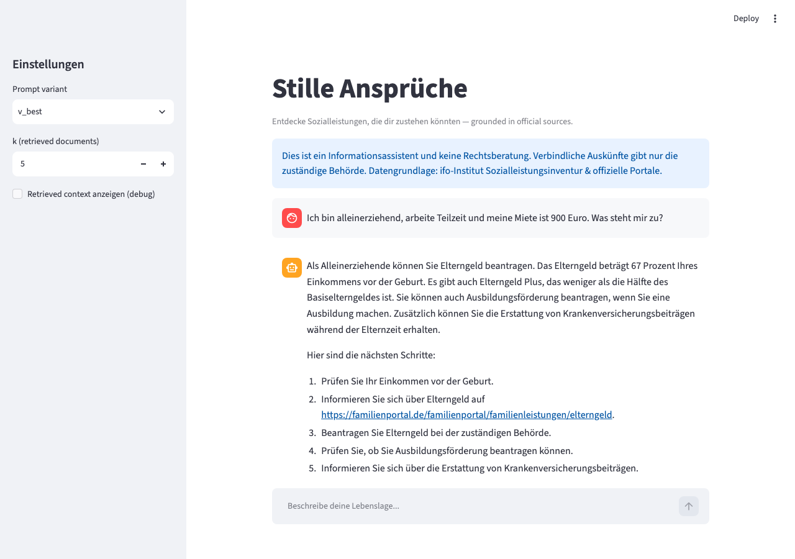
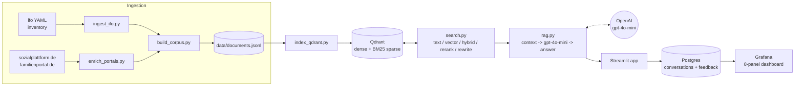
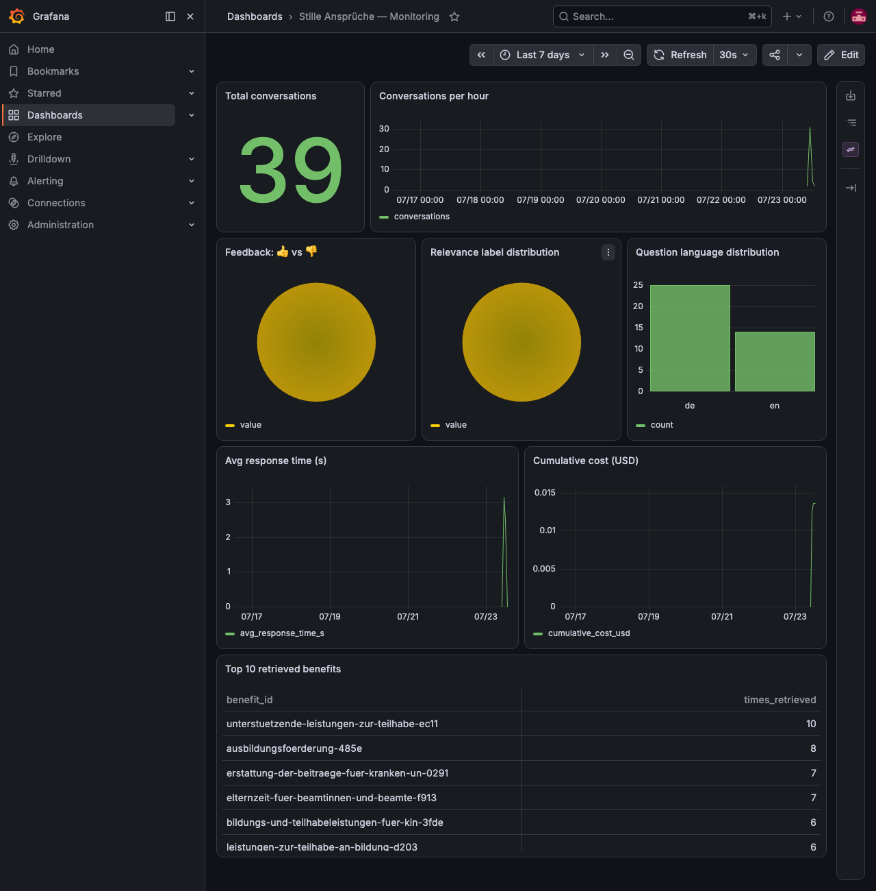

# Stille Ansprüche

*Discover German social benefits (Sozialleistungen) you may be entitled to but don't know exist.*

> See [`docs/README_PROJECT_EVALUATION.md`](docs/README_PROJECT_EVALUATION.md) for the full
> rubric-by-rubric evaluation mapping — a fast path for reviewers.



## Problem

Germany has 500+ distinct social benefits (Sozialleistungen), per the ifo Institute's 2025
inventory of the country's welfare system. Decades of research from IAB and DIW, and a 2025
Human Rights Watch report on burdensome application processes, converge on the same finding:
a large share of eligible people — commonly cited at 40–60% for means-tested benefits like
Grundsicherung im Alter — never claim what they're entitled to. This is documented as
predominantly an *information* problem, not an eligibility problem: people don't know a benefit
exists, don't know they qualify, or don't know where to start.

Stille Ansprüche ("silent entitlements") targets exactly that discovery gap. You describe your
life situation in plain German or English — *"alleinerziehend, Teilzeit, zwei Kinder, Miete 900
Euro — was steht mir zu?"* — and the assistant answers in plain language, grounded strictly in
an official/academic knowledge base, always citing the legal basis and linking official sources.
It does not calculate exact entitlement amounts (see Limitations) — it helps you discover which
of the 500+ benefits are worth investigating further.

The closest existing project, CityLAB Berlin's **Beyond Forms** (July 2026), covers exactly one
benefit and focuses on *filling out its application form*. Stille Ansprüche is complementary and
differently scoped: cross-benefit *discovery* across the entire landscape, not single-benefit
form-filling. This is the final project for the DataTalksClub LLM Zoomcamp.

## Dataset

- **Primary source:** [ifo-institute/sozialleistungen](https://github.com/ifo-institute/sozialleistungen)
  — a YAML inventory of German social benefits (21 law books, 502 entries), licensed
  CC-BY-SA-4.0. See [`data/ATTRIBUTION.md`](data/ATTRIBUTION.md) for the full citation and
  license text.
- **Enrichment sources (best-effort):** [sozialplattform.de](https://sozialplattform.de) and
  [familienportal.de](https://familienportal.de) (both official federal portals) — plain-language
  descriptions scraped politely (custom User-Agent, robots.txt-respecting crawl delay, every
  response cached) and matched to ifo entries by fuzzy title match. 49 / 502 benefits (9.8%)
  were enriched this way.
- **Corpus:** `data/documents.jsonl`, 502 documents (one per benefit; none needed chunk-splitting
  — the longest composed document was 4555 chars, under the 6000-char threshold). Each line is a
  JSON object:
  ```json
  {
    "id": "wohngeld-3f2a",
    "name": "Wohngeld",
    "law_book": "WoGG",
    "legal_norm": "§ 1 Zweck des Wohngeldes - WoGG, § 26 Zahlung des Wohngeldes - WoGG",
    "category": "Wohnungsbeihilfe",
    "target_groups": ["Jedes Alter"],
    "topic_fields": ["Wohnen & Infrastruktur"],
    "text": "Wohngeld. Zuschuss zur Miete... Rechtsgrundlage: ... Zielgruppen: ... Themen: ...",
    "official_url": "https://sozialplattform.de/wohngeld-0",
    "enriched": true
  }
  ```

## Architecture



## How to run

Requires Docker (with Compose) and an OpenAI API key.

```bash
git clone https://github.com/abhirup-ghosh/stille-ansprueche.git
cd stille-ansprueche
cp .env.example .env   # then edit .env and set OPENAI_API_KEY

make up            # builds the app image and starts qdrant, postgres, grafana, app
make index-docker  # embeds data/documents.jsonl (502 docs) into Qdrant
make seed          # optional: seeds ~15 demo conversations + feedback for the dashboard
```

- App: http://localhost:8501
- Grafana: http://localhost:3000 (admin/admin)

`make up` always rebuilds the app image (`docker compose up -d --build`), so it also picks up
code changes on re-runs. This exact sequence has been rehearsed end-to-end from a fresh `git
clone` in an empty directory — see `docs/PROGRESS.md` / `docs/DEVIATIONS.md` (Phase 7) for the
three bugs that rehearsal caught and fixed.

For local (non-Docker) development: `make setup` (creates `.venv`, installs
`requirements.txt`), then `make ingest` → `make index` → `make ground-truth` →
`make eval-retrieval` → `make eval-rag` → `make app`. `make test` runs the pytest suite.

## Retrieval evaluation

Ground truth: 1000 questions (800 German, 200 English) generated by an LLM from 200 sampled
benefit documents (all 49 enriched + 151 random ifo-only, seed 42) — 4 German + 1 English
question per document, deliberately phrased as a person's life situation *without* using the
benefit's official name (see `src/generate_ground_truth.py`). Evaluated with Hit Rate@k and
MRR@k (k=5 primary, k=10 also) against `data/documents.jsonl`'s 502 documents, split by
question language (`data/eval/retrieval_results.csv`, full table below).

| strategy | lang | hit_rate@5 | mrr@5 | hit_rate@10 | mrr@10 | n_questions |
|---|---|---|---|---|---|---|
| text | de | 0.052 | 0.028 | 0.125 | 0.037 | 800 |
| text | en | 0.020 | 0.015 | 0.035 | 0.017 | 200 |
| text | all | 0.046 | 0.025 | 0.107 | 0.033 | 1000 |
| vector | de | 0.311 | 0.194 | 0.429 | 0.210 | 800 |
| vector | en | 0.165 | 0.089 | 0.280 | 0.104 | 200 |
| **vector** | **all** | **0.282** | **0.173** | **0.399** | **0.189** | **1000** |
| hybrid | de | 0.233 | 0.134 | 0.359 | 0.150 | 800 |
| hybrid | en | 0.155 | 0.087 | 0.255 | 0.100 | 200 |
| hybrid | all | 0.217 | 0.125 | 0.338 | 0.140 | 1000 |
| hybrid_rerank | de | 0.286 | 0.170 | 0.396 | 0.185 | 800 |
| hybrid_rerank | en | 0.235 | 0.141 | 0.305 | 0.150 | 200 |
| hybrid_rerank | all | 0.276 | 0.164 | 0.378 | 0.178 | 1000 |
| hybrid_rewritten | de | 0.281 | 0.154 | 0.395 | 0.169 | 800 |
| hybrid_rewritten | en | 0.180 | 0.107 | 0.295 | 0.122 | 200 |
| hybrid_rewritten | all | 0.261 | 0.145 | 0.375 | 0.160 | 1000 |

**Winner: plain dense vector search** (MRR@5 = 0.173 overall), used as `search_best` in
`src/search.py` and by the RAG flow. Pure BM25 text search is nearly useless here (MRR@5 = 0.025)
— by design, the generated questions describe a life situation without ever naming the benefit,
so keyword overlap with the corpus is minimal; this is exactly the real-world discovery problem
the project targets. Because BM25 is so weak, naively RRF-fusing it with vector search in
`hybrid` actively *hurts* vector's ranking (MRR@5 drops from 0.173 to 0.125); cross-encoder
reranking (`hybrid_rerank`) recovers most of that loss (0.164) but doesn't fully surpass
vector-only, since the fused candidate pool it reranks has already been distorted by weak BM25
scores. Query rewriting (`hybrid_rewritten`) helps hybrid (0.125 → 0.145) but still trails vector
alone. All strategies degrade on English questions vs. German (expected — the corpus and E5
embeddings are strongest in German), and query rewriting narrows but doesn't close that gap.

## RAG evaluation

The RAG flow (`src/rag.py`) retrieves with `search_best` (dense vector, per above), builds a
context block from the top-k hits, and sends one structured-output LLM call (`gpt-4o-mini`,
temperature 0.3) that returns the answer plus which benefits it drew on. All 3 prompt variants
share the same hard grounding rules (answer only from context, never invent amounts/deadlines/
conditions, cite the legal norm and link, answer in the question's language, end with the
non-legal-advice disclaimer) and differ only in style:

- **baseline** — "answer helpfully and correctly"
- **einfache_sprache** — Einfache Sprache: short sentences (≤~12 words), no unexplained jargon, numbered next steps
- **structured** — fixed sections: short answer, matching benefits with reasons, next steps, sources

Evaluated on 100 sampled ground-truth questions (80 de / 20 en, seed 42) × 3 variants = 300
answers, each judged twice by `gpt-4o-mini` (temperature 0): a **relevance** judge
(RELEVANT/PARTLY_RELEVANT/NON_RELEVANT against the question) and a **faithfulness** judge
(FAITHFUL/MINOR_UNSUPPORTED/HALLUCINATED against the retrieved context) — 900 LLM calls total,
$0.18. Full results in `data/eval/rag_results.csv`.

| variant | %relevant | %faithful | mean_sentence_len | mean_cost_usd | mean_time_s |
|---|---|---|---|---|---|
| baseline | 91.0% | 41.0% | 14.2 | 0.00068 | 4.13 |
| **einfache_sprache** | **87.0%** | **57.0%** | **6.1** | **0.00059** | **3.37** |
| structured | 80.0% | 36.0% | 17.2 | 0.00050 | 2.52 |

**Winner: `einfache_sprache`** (57% faithful, highest; also cheapest and fastest among the two
close contenders), set as `PROMPT_VBEST` in `src/rag.py`. Relevance is high across the board
(80–91%) — retrieval quality, not prompt style, is the bottleneck there. Faithfulness is what
separates the variants: `einfache_sprache`'s short, simple sentences (mean 6.1 words) leave much
less room for the model to elaborate beyond the context, while `structured`'s multi-section
format (mean 17.2 words/sentence) — asking for reasoning per benefit and separate "next steps" —
invites more inferred detail not strictly grounded in the retrieved text, which the faithfulness
judge penalizes most (36%, the worst of the three). `baseline` sits in between on both length and
faithfulness. In short: for this grounded-answer use case, verbosity and structure trade off
against faithfulness more than they help relevance.

## Monitoring



Every conversation (question, answer, language, prompt variant, retrieved benefit ids, relevance
judgment, tokens, cost, response time) is logged to Postgres (`src/db.py`), and every 👍/👎 click
is logged to a linked `feedback` table. Grafana (`grafana/dashboards/stille.json`, auto-provisioned)
has 8 panels, all backed by live SQL against that data:

1. **Total conversations** (stat)
2. **Conversations per hour** (time series)
3. **Feedback: 👍 vs 👎** (pie)
4. **Relevance label distribution** (pie)
5. **Question language distribution** (bar)
6. **Avg response time (s)** (time series)
7. **Cumulative cost (USD)** (time series)
8. **Top 10 retrieved benefits** (table)

`make seed` populates ~15 demo conversations + feedback so the dashboard isn't empty on first run.

## Rubric self-assessment

Full evidence-linked mapping in
[`docs/README_PROJECT_EVALUATION.md`](docs/README_PROJECT_EVALUATION.md), against the official
course rubric. Summary:

| Criterion | Points claimed | Max |
|---|---|---|
| Problem description | 2 | 2 |
| Retrieval flow (KB + LLM) | 2 | 2 |
| Retrieval evaluation (multiple, best used) | 2 | 2 |
| LLM evaluation (multiple, best used) | 2 | 2 |
| Interface | 2 | 2 |
| Ingestion pipeline (automated) | 2 | 2 |
| Monitoring (feedback + dashboard ≥5 charts) | 2 | 2 |
| Containerization (everything in compose) | 2 | 2 |
| Reproducibility | 2 | 2 |
| **Core subtotal** | **18** | **18** |
| Best practice: hybrid search (evaluated) | 1 | 1 |
| Best practice: document re-ranking | 1 | 1 |
| Best practice: query rewriting | 1 | 1 |
| **Best-practices subtotal** | **3** | **3** |
| Bonus: cloud deployment | 0 | 2 |
| **Total claimed** | **21** | 21 (+2 unclaimed) |

## Cost report

Every LLM call goes through `src/llm.py`, which disk-caches by `(model, temperature, messages)`
so re-running any script is free on a cache hit, and tracks cost per the OpenAI pricing table.
Summing every unique cached call's token count across every environment this project ran in
(local `.venv`, the Docker container, and the fresh-clone rehearsal) gives an exact total spend
of **$0.28** for the whole project — well under the ~$3 target and the $5 hard ceiling:

| Step | Cost |
|---|---|
| Ground truth generation (200 docs × 5 questions) | $0.026 |
| Retrieval evaluation (query rewriting, 1000 questions) | $0.045 |
| RAG evaluation (300 answers + 600 judge calls) | $0.177 |
| Demo seeding (`make seed`, 3 runs across environments) | $0.021 |
| Manual smoke tests during development | ~$0.01 |
| **Total** | **~$0.28** |

## Limitations & future work

- **Enrichment coverage:** only 49/502 benefits (9.8%) have plain-language portal text; most
  answers draw on the more legalistic ifo description alone. `docs/FOLLOWUP.md` tracks ideas to
  improve this (more source sites, deep crawling, fuzzier matching).
- **No entitlement calculation:** the assistant helps discover *which* benefits might apply, not
  the exact amount you'd receive. Integrating
  [GETTSIM](https://github.com/ionos-gettsim/gettsim) (Germany's open-source tax-benefit
  microsimulation model) is a natural next step for that.
- **No application form-filling:** unlike CityLAB Berlin's Beyond Forms, this project doesn't
  help complete an application — it stops at "here's what to look into and where."
- **Evaluation on synthetic questions:** the ground truth (and RAG judges) are LLM-generated, not
  real user queries — they may not fully capture how real people phrase confusing situations.
- **ifo inventory completeness unverified:** `docs/FOLLOWUP.md` also flags an open item to
  independently cross-check whether the 502-entry ifo inventory is missing any well-known German
  benefits.
